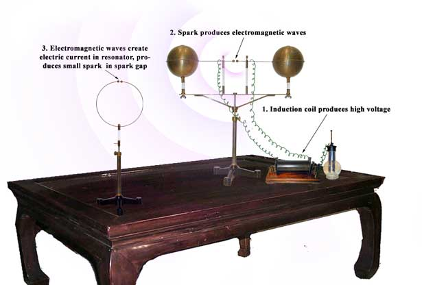
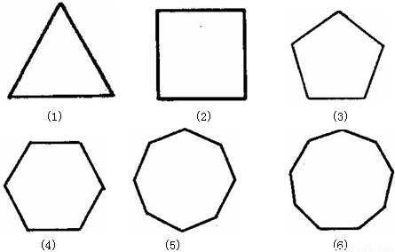
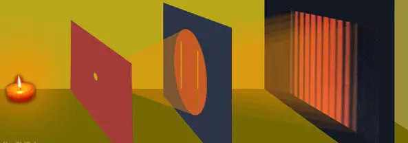
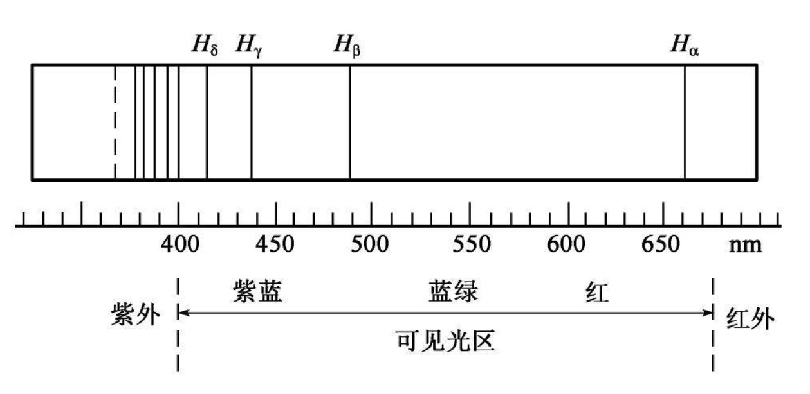

# 量子史话

【美】B.霍夫曼

马元德 译，科学出版社，1979 年 5 月第一版，字数 156，000， 定价 0.5 元


整理者（HJiahu@outlook.com）说明：

* 将这本书整理成文字版纯粹是因为个人喜欢这本书，请勿用于商业用途
* 为了方便理解，我在书中添加了一些图片。本文尽最大努力与原文保持一致，与原书不一致的地方我都加了说明
* 感谢 QQ PC 版中的文字识别功能。本文首先使用 QQ OCR 将图片转化为文字，然后人工检查与排版
* 书是上世纪 70 年代翻译的，很多术语和现在有些差别，但并不影响阅读。为和原文保持一致，这部分内容我未作修改

## 序言

科学家根据一些理论 ，企图了解神秘的原子世界，这本书打算给愿意探索这些理论的人当作一本人门书。 核裂变和原子弹并不是原子科学的全部内容。在这两样背后， 还有多少不寻常的思想和激动人心的事件，不了解这些，我们的认识就真可说贫乏了

量子的史话，是好多国家的科学家们在物理世界前所未见的一片宽广的前沿，茫然摸索寻求知识的史话。他们这样寻求知识时，得到内心闪现的见解的启发，以及偶然事件和猜测的帮助；一些预料在小说中才会见到的那种巧合，又给这件事增添生色

这是一场激烈动乱的革命的史话，是逐渐破坏一种曾长久统治有限领域的自满的物理学的史话，是随后的政权空白状态由于自己内在的矛盾而注定消灭的史话，是一种大大变得谦虚的体制——量子力学——如暴风雨一般出现的史话

虽然量子力学坚决统治着新发现的国土，但它的胜利并没有完成。在它的领土的光辉灿烂的表面上，有一些看来仅仅是轻微擦痕的地方，显出是迷人的裂隙，它们泄露出内部的黑暗，引诱勇猛无畏的人继续作新的冒险。而且，量子力学也不是掌握着绝对的势力，它必须同另外那个造反者相对论分掌大权；而虽然在我们寻求知识当中，这两个理论一起作出了最深刻的进展，它们却必定彼此继续为敌。要等到一个更加有力的理论把这两个理论都征服了，它们的根本分歧才会得到解决；新理论将消除关于空间和时间、物质和辐射以及因果关系等问题，我们现在煞费苦心所获得的种种幻想。这个理论的性质我们只可以猜测，但是它最后总要到来，这和我们的文明会延续下去一样确实无疑——恰恰一样

离了人们所谓的空间和时间，我们的字宙是不可想象的；那么空间和时间这两个有力的幻影是什么呢？物质以那样多的奇妙形式存在于我们自身的内部和周围，它既是精神的仆人，又是精神的主子，作为造成万物的主要手段，它在宇宙的等级体系中占据荣耀的品级；那么，物质这种神秘的实体是什么呢？辐射飞越浩瀚的虚空疾如闪电，这种最快速的天空信使又是什么？

虽然正确的答案是不会有的，可是科学注定要为这样的问题焦心。它必定永远围绕着这些问题编造暂时的理论，打算凭理论抓住某种真理的幼芽，在上面放稳它的复杂的上层结构。可是这平衡是脆弱不稳的，一有任何变动，就把沿这大厦传播的震颤直送到最高的顶端。相对论的史话说明，当空间和时间的一个暂定的理论屈服于另一个暂定的理论时，科学出现了什么情况。量子的史话叙说我们的物质和辐射理论近来经历的奇遇，叙说这种理论的意想不到的后果

象量子论这样抽象的问题，很适合当作那种满篇是生僻的高等数学行号的学术论者的基础。在这本书中，谈量子的史话不用数学，然而在概念方面也没有重大删略。书里也有在工作中的科学理论家的形象一瞥，他们作思想概念的实验时，纸和笔便是他们的工具。科学理论家有一种才能，这在他们的各样天赋当中不算是最不重要的：他们能从后来被证明是错误的前提得出有价值的结论。因为他们的洞察力很深刻。不论这里有个暗示或那里有个线索，或是一个粗疏比拟或是一个胡乱猜想，他们总是据手头的任何材料构成基本的假说，靠非凡的直觉天赋作向导，勇敢地跟随着精神中的荧荧的磷火，直到它给他们指明一条趋向真理的道路

量子力学上升到现代科学和哲学中的一个统治地位，这宏伟壮丽的兴起，构成段常常近于不可信的戏剧性重大探新的史话。这是一个内容混乱的故事，但是在表面上的混乱中间，我们逐渐辨认出一个精美的结构；每一个发现，不管它表面上多么不相干或多么荒谬，都巧妙地归入它的指定地位，一直到整个这复杂的纡曲图式显出是人类精神的一个主要发现

[TOC]

## 第一章 开场白

一间仔细遮暗了的实验室，靠屋角摆着一台电学仪器，上面两枚金属做的小球晶晶闪亮，带着威胁的神气，蹙眉怒目，仿佛嫌它们彼此离得太近了。这是一台制造电花用的标准仪器，稍微加了点东西：用细长导电杆给小球连上两个金属片，好象给这个双眼怪添了两只硕大的耳朵

在另一张桌子上，立着一个装在绝缘底架上的刚硬金属线圆环，这是一个几乎闭合的简单圆环。对实验者来说，这圆环上的小间隙是整个装置的关键部分。如果他推测得正确，秘密就是要在这里揭开的（整理者注：*下图由整理者添加*）



一切都准备就绪，实验者合上开关，于是两个小球之间电花劈劈啪啪地响起来。他背过脸去不看闪耀的电花，等待眼睛逐渐适应于黑暗。那是他的想象呢，还是他真的看见一团微弱的辉光充满圆环上的间隙？这很难讲。也可能只是反射的光。他轻轻地转动螺旋，推间隙两端靠拢，间隙越来越窄，同时辉光似乎亮起来。更接近些、接近些，最后，两端几乎要碰在一起。现在不会有疑问了。实验者松一口气：微小的电花正横穿过间隙

用这么一种出奇简单的方式，人类第一次有意识地探测到一个无线电信号

这是在 1887 年，实验者是一位优秀的德国青年物理学家海因利希·赫兹。这个发现有无可估量的商业价值。那么， 象赫兹那样有
才干的人，为什么却等马可尼去利用它攫取丰富的报酬呢？赫兹进行他这个划时代的实验，根本没存心发明什么象无线电报那样实用的东西，而无线电报大概也不是他的实验的最重要的结果。赫兹派给自己一项长期难倒科学家们的任务：检验苏格兰物理学家詹姆斯·克拉克·麦克斯韦在二十三年前提出的关于光、电和磁性的一个高度数学化的理论是否正确。至于这项工作的商业价值，他的心思里似乎从未有一点这念头作崇；而对纯粹科学研究本身的这种热心，在某种意义上却是造成一个极有讽刺意味的情况的原因。因为若没有这种热心，赫兹就可能永远也不会为他在实验当中看到的一个表面上无足轻重的效应去费脑筋。这些实验到处受人的欢
呼，被认为在磐石般的实验事实的基础上，出色地证实了麦克斯韦理论的正确性。然而， 他看到的那个表面上无足轻重的现象，到爱因斯坦手里，却注定要在量子论的发展中起重大作用，从而对准麦克斯韦的理论来一个粉碎性打击，叫它永不能彻底翻身

为了真正认识麦克斯韦与赫兹的贡献，以及量子的全部史话，我们必须先略说一说过去人们关于光所提出的一些理论

虽然在近代出了许多著名的犹太科学家，古代的希伯来贤哲们可是天生没有什么科学探索的素质。他们既引用“神说，要有光，就有了光”（源自《圣经》，《创世纪》第一章第三节——译者）这句断言，把关于光的全部问题一笔勾销，便迅速转到更重要的事情上。在他们看来，光亮不过是黑暗的反面，是让人能看见东西的环境

可是，希腊人的科学才能比较扎实，他们提出了一个非常重要的新见解。他们认识到，一定有某种东西跨越我们的眼睛、我们所看见的东西和照亮这些东西的灯之间的距离，所以，他们认为那种东西具有客观现实性，并着手去研究它，创立一些学说去解释它。近代的科学家谈论光时，他心里所想到的就是这种东西。能看见东西仅是一种感觉；区分这种感觉和具有新涵义的、比较客观的光，是一个重要的区分，这跟区分人被一块石头打中时体验到的感觉，和实际穿过空中打来的那块石头是类似的

不幸，希腊人在有一个可喜的开端后，却陷入了互相冲突的各派说法中。根据其中一个说法， 光是一种象水射出水龙带那样从眼睛里射出的东西；这种见解是：我们看见一个物体，是靠把这样一注光对准它，击中它，这很象瞎子“看见”东西，是靠伸手摸到它。这个说法可以解释为什么我们只看得见对面的东西，为什么闭眼就看不见。但是它无法解释另一些问题，比如为什么在暗处看不见。哲学家柏拉图曾经努力想对付这类的反对理由，他提出一个学说，其多余的作用方式之多，确是叹为观止。他要求有三个独立的流注——一个从眼睛射出，一个从所看见的东西射出，一个从照亮东西的灯射出——之间的三重相互作用！柏拉图的难处在于他一开始就把方向看错了。按照现代的见解，我们如果看见什么，那是因为光进人我们的眼睛而不是离开眼睛；事情妙就妙在，这种见解早在柏拉图以前一百多年，伟大的毕达哥拉斯就已经有力地提出过了。毕达哥拉斯的理论很简单，它主张光是由任何发光体向四面八方射出的一种东西，这种东西西到障碍物上就立刻弹开。如果偶然间它最后进人人的眼睛， 就叫人感觉到看见使它最后弹开的那件东西

我们看到，在这一点上大自然顶挥霍浪费，它向四面八方抛洒它的大量的光，以保证引起人的注意，丝毫不表现它在葡萄柚的精确无误上喜欢显露的那种节约精神”（葡萄柚是一种热带果树，果实大小如橙子，成串生长，累累像葡萄。从果实的搭配来看，确实表现出高度的精确性和节约精神。一译者）

当然，光的问题根本没有因这种理论而得到解决。我们的困难方在萌芽。科学上的每一样新发现都带来一大堆新问题，正好象一发明汽车， 随着就有了加油站、公路、汽车库、修车工和许许多多别的辅助项目。例如， 这里我们一认识到必定有某种东西跨越眼睛和所看见的物体之间的空间(这种东西我们给它取名叫“光”)，就算为洪流般的大量有关它的问题打开防洪闸门；这些问题在我们知道应当就光发问以前，是不大会提出的。例如，光是什么形状的，它有多大？甚至可以问，它究竟有没有形状或大小？它是物质性的还是以太性的？它有重量吗？它会使它所撞到的东西震动吗？它是热的呢，还是冷的？它移动得多快？它到底移动不移动？既然它不能穿透薄的硬纸板，它怎么有办法透过玻璃呢？各种颜色由这同一种光传递吗？我们一旦发现存在光，便产生这些问题及一大批更加伤脑筋的问题

我们把量子的故事讲下去，就将遇见一些这类问题的答案，并且会欣赏科学反复改变想法的场面。别的问题，因为答案在这个史话的主流以外，就不再提起了。曾经出现了两种理论，说明光是怎样跃过空间，给人的眼睛捎信的。我们开始先自问，如何去移动一块够不着的石头。只有两个不同的办法，它们相当于这两种光的理论。一个办法是向石头扔东西，另一个办法是用棍子捅它

扔东西的主意是第一种理论、 即所谓粒子说或微粒说的思想源泉。按照这一说，光是由亿万个小点点即“微粒”组成的，微粒由发光体向各方射出，好象一颗不断爆炸的炸弹的碎弹片

另一种理论——波动说——是仿照棍子法构成的。可是，必须稍解释一下，因为乍看来全不明白，用棍子捅石头跟波动真会有什么关系。不过，我们别忘了，一根棍子再硬也必定微微有点可压缩。我们为了让这个基本事实在心中留下生动印象，就算那棍子是果子冻（一种用凝胶(如琼脂)做成的甜点心。一译者）做的。当然，这种棍子即使在本身的重量下真有办法挺得住，也不会推动很沉的东西。但是，在抽象科学中一现在谈的是抽象科学 ，尽管表面上似乎跟烹调法很有关系——在抽象科学中 ，重要的是原理，这里讲的原理是：棍子决不会硬到十分。所以它可算果子冻。为了给它一个奋斗成功的机会，我们必须把石头换成乒乓球。推果冻棍子的一头，会发生什么情况呢？另一头不是立刻动。但是，有一个震颤开始顺着棍稳稳地往前传，过充分时间后传到那一头，使它动起来，这才推动乒乓球。用一根钢棍戳石头，情况也如此，只有程度的差别。现在关键性的问题来了。实际沿果冻棍移动的究竟是什么呢？那是一种脉动，一种纯粹的震颤！它全不是象抛出的石头那种物质性的东西，而是一种和阿丽思的柴郡猫（英国数学家、儿童文学作家路易斯.卡洛尔(Lewis Crroll; 真名:Charles Lutwidge Doigson, 1832- 1898 年)所作著名童话《阿丽思漫游奇境记》中的人物：此猫常无故傻笑。一译者）消逝后仍留下的咧嘴笑脸一样摸不着的东西，然而也是一种走完行程后能推动乒乓球的东西。如果我们把这情况仔细思量，提炼出它的内在本质，便得出这样一个结论：光可以象波动那样地活动，把它的信息从一个地方带到另一个地方。实际上，我们已得出一种光的波动说

可是，这是在什么里面的波动呢？一个波动毕竟并不就是一个波动。它总要是在某种东西里面的波动。也许它会是空气中的波动？不会的，因为光能够穿过真空传播。单是这个事实就已表明，它不可能是任何物质媒质中的波动；如果有什么物质性的东西充满真空，那它便不再是真空了。这样说来，由于缺少一种媒质好让我们所讲的波能在那里面波动，就得抛弃这理论吗？不！为了缺少一个目前谁也不能希望推翻的简单假说，哪个科学家也不会放弃一个大有前途的理论。这里无非是需要讲，准有一种什么无所不在的、非物质性的媒质，光是里面的波动，然后再精心给这种媒质加上一个响当当的尊号。它被称为光以太，它存在的唯一理由就是使光的波动说形象化，显得可信，为这个学说撑腰

于是便有了两派彼此抗衡的光的学说：微粒说和波动说。那么，哪一派正确呢？伟大的艾萨克·牛顿爵士，在仅仅十二年的科学活动当中，就作出了他在动力学、引力理论、微积分学及许多别的科学部门中的一切基本发现，而他在那段时期还有功夫在光学中作出重大进展。他感到，由于波可以绕拐角传播，光走直线的道理用波是无法解释通的，所以他宁愿要微粒说。固然，那时关于光，已知有许多奇妙事实同微粒的看法似乎是不符合的。可是牛顿，一个有绝顶才能的人，克服那样的难题倒不大费力。到他完成这项工作时，他已经做到了对那时关于光所知的一切事情几乎都能解释，只稍微牺牲一点简单性而已。他所讲的微粒已不再是不带特性的了。根据实验事实， 他不得不讲微粒受反射的本领有一种奇妙的消长。光不再类似旧式大口径枪的发射，倒类似鸟的一起一伏的脉动式的飞翔。当我们说根据后来的历史（原文是双关语，也解作“我们说在后来历史上的光概念中”。——译者）这种有节奏的脉动将表明具有重要意义的时候，我们并不是想说一句双关的俏皮话

虽然波动说在牛顿时代也不乏拥护者，可是有那么一个天才巨人站在反对它的立场，它就没有多大得胜的希望了。以荷兰物理学家惠更斯为首的波动论者，把他们的主要希望寄托在一个事实 上，这就是：微粒相碰时应该彼此弹开，然而实验证据却表明实际情况正相反，两道光尽可彼此交叉，遭不到任何破坏。不过，一个理论要同牛顿的脉动微粒说相抗衡，只拿这一点作基础是不够的

牛顿逝世后，关于光有了新的实验发现，又发明了新的方法来处理波动的困难的数学问题。微粒说尽管简单巧妙，还是倒霉了。人们发现，光波仅仅是微小的波，从一个波峰到下一个波峰长五万分之一英寸左右，这时便可以对付那种认为波本应该绕角转弯的反对理由了，因为这样微小的波是不会明显展开的。当然，它总要展开一点，可以推测，这表示光不应该投下绝对分明的影子，而应当在棱角处产生确定的条纹图样。甚至在牛顿时代，实际上也已知道存在这种条纹，而牛顿一直提不出真正圆满的说明。实验和理论两方面的一切新证据都明确地不符合微粒说，在牛顿死后大约一百年，波动说由法国人非涅耳发展到高度完善，打败对手，代之完全得势。菲涅耳把光的波动说发展得非常有力而简洁，当时已有的那么多复杂漂亮的实验，没一个它解释不通。 如果说还需要有进一步的证据去证明微粒说是错的， 那么，这种证据后来也找到了，这就是法国人傅科的那个重要的实验：在水中实际测量光速。因为在这一点上两派理论有重大分歧。在虚空中，光以每秒 186,000 英里这样难以想象的速度传播。照牛顿讲，光在水中的速度应当更大，而波动说则坚持这时速度一定较小。科学等待很久，才出了个傅科，他成功地设计了一个实验方法，测量出这种极大的速度。经过实验，证明水中的光速比空气中的光速刚好小波动说所预计的数值。微粒说的照命星陨落了，从此以后，天空中有了新的光

当时波动说的证据已经是压倒一切了。然而，它还要得到更重大的支持。菲涅耳时代后不久，多少有点停滞不前的古老的电磁科学出现复兴，而最值得注意的是英国人法拉第的实验研究工作；他发现电磁感应，发明电机，为现代电工学今天的成就奠定了基石

法拉第不大懂得专门数学，这种情况对数学化程度那么深的一门科学中的小人物来说，本来会成为无法克服的障碍。可是在法拉第，这却要当宝，因为这一来他不得不孤军作战，创造一套个人用的形象讲法，来解释他自己的实验结果。这套讲法简单之至，表面上特别非数学化，它的根据是法拉第所谓的“力管”，虽然起初它也难免受当时专业数学家们的嘲笑，但它终于表明有的地方胜过那些人自己的讲法。数学家主要从产生电磁效应的金属块和线圈去探寻电磁效应的秘密。法拉第根本不同意这个。在他看来，按真实的意义讲，问题硬是牵涉到整个宇宙，导线、磁体以及其他材料的配件，是颇不关紧要的附属品。在磁体吸引铁块这个简单事例上，两种观点形成很好的对比。数学家感到， 在这件事情中最根本的问题是磁体、铁块以及它们离开多少英寸。反之， 在法拉第看来，磁体是一块非同寻常的物质，它是一个长着金属肚子的超级章鱼，向四面八方伸出许许多多无形的触手，直到宇宙的最尽头。就是靠这种触手——法拉第把它叫作磁力管——磁体才能够把铁往自己一边拉。 那些触手在法拉第说来是重要的东西；触手是最终的实在，而附带的金属碎块并不是

法拉第每有一个实验发现，都给他的见解带来新的支持。然而，长期以来大家觉得他的力管说缺乏数学化理论所必需的精确性。多少年后， 才有麦克斯韦对法拉第的见解大感兴趣，结果产生了物理学的全部历史上一些最精美的通则，它确实可以同爱因斯坦的相对论和量子论本身相提并论：前个理论牢牢地巩固它的普遍形式，后一个理论恰恰侵蚀了它的根本内容！

麦克斯韦的第一步是要把法拉第那种在表面上似乎很神秘的见解化成比较习见的数学讲法。这项工作本身非同小可，但是等它大功告成后，却显出法拉第的想法原来含有数学思想的真正精髓。由这项艰苦工作中诞生一个重要的新物理概念——场的概念， 它后来成为爱因斯坦的广义相对论的基础。电磁场多少可说是法拉第的力管的精炼的数学形式。这时我们不应该把空间看成充满一大群单个的触手，而必须想象，那些触手在一个均匀分布渗透一切的触手原质——电磁场内部使自身消融了。 电磁场应当看成一个基本的物理实在，是所有那些数不清的应力和张力的总和：当磁体吸铁时，当发电机发出电流时，当电气列车行驶时，当无线电波把我们的声音带到世界各地时，那些应力和张力的效应是可以观察到的。这一切张力所依附的那个遍在的东西叫做以太。但是为了使这种新以太和光的波动说所需要的光以太有一个细致的区分，前者称为电磁以太

麦克斯韦把法拉第的见解化成数学形式后仍不满足，他进一步推演这个学说的数学结论，扩展它的领域。不久他就遇到了矛盾。显然，这个学说不是处处如意，但是什么可能是补救办法，却不好确定。许多科学家都去寻找救药，麦克斯韦本人也在内。那时电磁理论已经非常精炼和数学化了，当麦克斯韦依据极靠不住的比拟，凭纯直观找到救药时，他提出的一组方程跟旧方程在外形上不过略有差别。可是， 新方程不但消除了矛盾，并且还带有一个重大的新含义。根据这些方程，应当存在电磁波这种东西，这种波应当按光速传播，而且应当具有光的其它一切已知的主要物理性质。其实，电磁波一定就是我们为解释光的一切已知情况而虚设的那种波。由于已经证明，菲涅耳的高超理论的繁复细节毫无例外地都包含在新的电磁方程中，这时似乎必然要把电磁波和光波看成一回事；这样一来，科学家们一直苦苦想分清的那两种以太也要看成一回事

要想使这个学说可以被人接受，必须先在实验室中用电学方法产生出麦克斯韦所假设的电磁波来。这可是件难办的事。困难主要还不在于产生电磁波，而在于怎样证明电磁波当真产生了。一年年过去了，并没有探测到这种波，物理学家们对麦克斯韦的见解是否正确开始有疑虑，尤其是因为那种见解所依据的是相当不严格的比拟。不管麦克斯韦的理论在纸面上多么美妙动人，如果不能在实验室中实际探测到电磁波，考察它的性质，这个理论大不了只能看成是个虽然相当可疑但却极为有趣的假说

麦克斯韦没有活到亲眼看见他的理论得到证实。直到他逝世七年后，他当初预言的电磁波才第一次被赫兹探测出来。在赫兹的简单圆环的间隙中穿过的微弱电花，只说明电磁扰动正在实验室内通过。要证明这种扰动是波，需要作仔细的考察。赫兹四处挪动他的圆环，观察电花强度的变化情况，来探试电磁扰动的动态。电花是那么暗淡，这件事谈何容易；然而用这样粗陋的办法，赫兹竟真的证明了电磁扰动表露出反射、折射及其他类波特性，并测量了它的波长。后来的测量表明，电磁扰动按光速传播，于是最后残留的怀疑一扫而光，电磁扰动的动态果然正象麦克斯韦原先预言的那样，它跟光波基本上是一个东西。赫兹的研究成果的真正意义不在于无线电报，而在于这件事，因为它证实了麦克斯韦理论是正确的

这可不是贫乏无味的理论。我们满可以问，当着人们的感官的明白证据，这个理论怎么能斩钉截铁地断言，无线电波和光波是同一类东西。它们的区别在于波的频率不同，即波脉动的快慢、波每秒振动的次数不同。在光的旧的波动说中，甚至在牛顿的脉动微粒说中，这是各种颜色的区别。这还能推广到别种形式的辐射上去。光波若是低频的，它就相当于红光。随着振动率的增大，颜色变为橙、黄等等，历经虹的各色直变到紫

可是，为什么要停止在可见光谱的两端呢？我们来预料一下以后的事情，以观全景。随着频率逐步增高，先达到那种叫做紫外线的不可见光，然后是 X 射线，最后是镭及其他放射性物质所发出的 γ 射线，以及宇宙线的一些组成部分。 按低于红光波的频率说下去，依次是红外线、热射线，最后是麦克斯韦和赫兹的无线电波。所有这些不同类的辐射，最终表明是同一个东西，只有振动频率上的不同，也不妨说，只是按颜色来讲不同。所有辐射在其性质上都同电磁现象有密切关连，同牛顿力学有密切关连。麦克斯韦理论的伟大，有几分就是由它所产生的这种绝美的统一性而来的

牛顿动力学的成就已经很可观，而在顶峰之上又有了这种高超无比的构思，科学满可以感到得意了。它现在不是已经把宇宙的活动方式化成了精确的数学定律吗？它不是证明了，宇宙必然万古千秋走它的既定道路，它的各部分的运动是按照从数学上讲精美雅致的、永远不变的图式严格确定的吗？它不是证明了，每个单个的物质微粒、辐射的一切微小细波及以太张力的一切震颤，都必然毫厘不差地符合人类与其数学终于阐明的庄严定律吗？在这方面的确有理由自豪。宏伟的宇宙受已知方程的支配，它的一切运动在理论上都可以预言，它的一切作用都按已知定律由原因庄严地进行到结果。不错，有一些无法克服的实际困难妨碍人们作出完全的预言，但是在理论上，假如能进行无数次观察和测量，完成繁难惊人的计算，那么宇宙的全部不可思议的命运会被揭露得详细无遗。没有丝毫基本的东西尚待发现。拓荒工作早已做了，现在只是扩展已有的知识的细节问题。当时，少数具有近乎先知能力的人已经能察觉到远方的风暴暗中趋近，但是他们的警告对打乱一般人的镇静无忧不大起作用。物理学基本上解决了，它原是一个完备优美的体系。物理学家们乐意自耕他们的园地，不知道他们不久会被抛到荒野里，因为普朗克及其追随者就要去尝那智慧之树（据《圣经》说，亚当和夏娃因吃了这树的果子，被赶出伊甸园，从此此生男育女，有了后代。参看《创世记》第二章第九节和第三章——译者）的味苦、但赋予生命的果子了

早在麦克斯韦以前很久，光的微粒说已丧失一切生存的理由。光的波动说从电磁学那样一个意外来源独立地突然重现，这一来，微粒说真的是死亡了

然而在 1887 年，就是在证实存在着麦克斯韦的波的那个实验中，赫兹注意到一个奇妙的现象。那个现象简直是微不足道，它仅仅是：当发送装置闪耀电花的光照到圆环的开口两端时，间隙中暗淡的电花就稍微容易产生一些

## 第二章 量子成胎

1887年，赫兹注意到了一个奇妙的事实，当紫外光照到他的装置上时，电花出来得稍微容易些

他不能领会到，这里他伸手可及，就有证明量子存在的证据，而且是一个至今仍是最清楚、最直接的证据。当时大家还不乐意接受这么珍贵的一份礼物。认识量子，这还得等到世纪之交，而且当有了认识的时候，还是从完全不同的方面认识到的

我们现在知道，量子真是彻底渗入天地万物。在物理学家方面，它几乎成了缠心之迷，萦绕着他的每一个方程，支配着他的每一个实验，又叫他同哲学家和教士就上帝和自由意志的问题，进行长久但却不总是有结果的辩论。它的来临已经使理论化学的某些方面发生革命性变化，而从化学只要迈一小步便到达生命本身的科学——生物学。然而，无所不在的量子虽然一再给人最明白不过的信号暗示它的存在，它却是在它的暗示有点隐晦的一个科学领域中最早得到人们的勉强承认，这说来一部分也是猜得巧的结果

量子是因为所谓“紫外灾变”的关系正式进人物理学的。这个绘形绘声的名称(它本来是应当为加利福尼亚大学一个学院的某著名数学家写的一篇惊险的烂杂志小说保留的)。物理学家们把它胡乱加到一个纯理论性的灾变上——按这一词的两个意义使用它

紫外灾变是这么一回事：如果我们计算一下物体加热时应该按什么方式发光，便会得出一个数学公式，按这个公式，全部能量应当老早就在一次灾变性的紫外辐射猝发中从物质里散出了

并不存在这样的事情，还只是断定这公式不正确的一个理由。然而，这个公式也不是糟糕到底。实际上，对低频光来说,结果是很好的。只有对高频光来说，这公式才乱了脚步，宣讲神秘的灾变

灼热体问题还有另一个解决途径，结果得出一个不同的数学公式，它成功地避免了紫外灾变，跟高频光的实验密切贴合

那么，这个公式把问题解决了吗? 决没有。因为虽然第一个公式按低频说极好，按高频说不对，可是第二个公式按高频要说不能再好了，按低频说却实在不能令人满意。两个公式，各只对了一半

简单地讲，在柏林那位理论物理学教授马克斯·普朗克开始他那一系列重大的研究工作时，这个领域中的事态就是这样

普朗克起初一味作些小小的纯猜测。他在各方面滥用这两个有缺点的公式，试一试它们的效果。到 1900 年，他偶然想出一个单独的数学公式，它按低频说正象第一个公式，按高频说正象第二个公式。这件事谈不到真正重要的推理论证。这主要是靠经验拼凑和见机行事，好比向这个人借条袴子，向那个人借件上衣，凑成一套衣服。普朗克凭着运气好、见识高，设法让袴子和上衣相配，结果配成的一整套比上衣和袴子分别算，价值不知高多少

新公式——它叫做辐射公式——跟实验非常一致。但是，现在普朗克发觉自已处在这样一个小学生的地位：他狡猾透顶地想法偷瞥了一眼当天课外作业的答案，可是发觉习题仍旧难作，心里懊丧。普朗克的新作业是要为他那么巧妙地创造的公式找到某种理论上的根据，他对这个新作业并不是完全没有准备。长时的研究毫无结果，因此他相信只有用大刀阔斧的手段，才能有希望挽救局面。这个重大信念使他心中有底，他发狂一般倾全力攻这个问题，仅仅几个星期后就找到了答案，这答案非常不合公认的传统，所以事隔十七个不平静的年头，它才为他博得诺贝尔奖金

精确叙述普朗克的推理论证，要涉及太多的数学抽象概念，但是他的研究的精神，用一种稍稍简化的讲法也许还能传出几分。这种讲法虽然不是照原话叙述他的论点，至少从叙事法上讲是精确的，因为象寓言那样，一般特性和风味有一部分保存下来。假如把这段故事说得仿佛实际上准确无比，也没大害处

数学上有一种巧妙手法，是古希腊人发明的，它把一个无从着手的匀滑情况换成一串细小的急跳，这便大大容易进行数学处理。这种手法是微积分的基础，按总的情况讲是个简单的手法。举个例，如果我们去计算(而不是度量)直径为一英寸的圆的圆周，就会发觉匀滑的圆周不大能当作数学上的立足点。因此，我们在眼前没有圆时暗自摸索这个问题。首先盘算有什么东西真可以作个牢固的思想立足点。 这样，我们在到达一个俯瞰这滑溜溜（“要小心的”，“不易把握的”——译者）问题的安全位置后，就可以突然跳到这问题上而不致有滑跤的危险



这样，就圆周讲，我们把圆划分成四、八、十六....等分，用直线把分点连起来，如上图（整理者注：*上图和原文有些许差别*）。这些正多边形每一个都可以计算周边总长，很明显，随着取的边越来越多，越来越短，边的总长越来越接近圆的圆周。例如， 十六边形的周边总长比正方形的各边总和跟圆的圆周要接近得多。数学家的作法是计算一个一般边数的图形的周长。完成一般计算之后，再让公式中的边数无限增多，于是突然把尖角展平。照这样，不容难办的匀滑性介入计算细节，最后得出一般公式。附带提一下，单位直径的圆的圆周用希腊字母 π 表示，这个数目在量子论中不断出现。说近似值，π是 3.14；可是如果我们要写出它的精确值，它就猛烈反对，表现得象一匹骑兵骏马在鞭策下一直向前跑下去而不重走旧路，让人完全无法忍受：

```
π = 3.141592653589793238462643383279502884197...
```

现在话归原题普朗克。还在 1900 年以前他已经证明，对于他的特定目的来说，一块物质可以用无数个有节奏地上下跳动的粒子来代表。有的粒子跳得较快，有的较慢，包括一切振动频率。这些个普朗克所谓的振子，只有一项简单任务：振动加猛时吸收热能和光能，而在猛烈程度降低时再放出能量。它们正象孩子们的秋千，受到人推时荡过的圆弧越来越大；而且它们可以象海绵含水那样自然地含着能量

一块物质变热就是吸收能量。普朗克利用他的模型，计算物质在任意温度下怎样含住和放出热和光。由于他讨论的是吸收或发出的能量大小的平稳变化，他运用了刚才讲的巧计，把平稳变化改换成他可以计算的急跳的变化。他完成计算时发现，果如所料，假若他按照一贯的老办法展平能量急跳，他马上退回到紫外灾变。知道当天作业的答案好处无穷，这一点现在表现出来了。从一开始，普朗克已准备抓住任何适当机会，做一件小小不得体的事，只要它会给他正确答案。现在，他在自己的计算中看到他正在寻找的机会，一个绝妙良机，然而也是个铤而走险的机会，因为它招来的绝不是小不得体的事。如果他能够跟物理学说的一个最神圣的惯例决裂，不同意把能最急跳展匀，他就能看出一条道路， 获得那个他知道会同实验一致的答案

可是这样的想法真古怪；那就象说一架秋千摆荡， 摆可以是一码，或两码、三码、四码等等，但不可以是一又四分之一码，或其他任何居间的值。连毛孩子也会懂得这类玩意儿多古怪。然而它却的确得出了恰当的答案......

假如普朗克让一切都变成平滑的，那么，高频率几乎会抢占去全部能量，造成灾变。反正他总得约束高频率。听任能量急跳本身倒是不解决问题，但这使人有机会对高频率实行一种歧视，而这在经典物理学的法律下是违宪的。因为如果普朗克发布命令说，能量必须按匀齐的捆一捆一捆地发送，他然后就可以更进一步，惩罚不守规矩的高频率，强要它拢成比低频大得多的捆。那么， 一个低频率可以轻易找到它的捆所需要的少量能量。可是一个高频率要聚集沉重的定额，可能性就小得多了

普朗克使用了一个方便合用的词， 这是一个甚至在科学文献中别的方面实际上已经出现的词：他把这种捆或定额叫做一个能**量子**

为了使答案正确，普朗克发觉他必须按照一个明确的定则规定任何一个频率的能量子，而且这个定则即使从物理学观点看不算是，但以数学观点看也要是个简单得惊人的定则。他引人一个他以字母 h 表示的特别的量，提出一个在原子物理上具有爆炸性的辉煌公式:

```
能量子 = h ✖ 频率
```

普朗克所引入的基本量 h 现在称作普朗克常数，是新物理学的壮丽标志，也是蔑视旧制度的中心象征。由它要产生天大的事件，然而它本身可算不上所谓的大。它的值仅仅是

```
0.000000000000000000000006...
```

h 竟这样小到极点，这就表示能量急跳弱得不可想象。然而，不把它完全展匀这件事带有一股火与硫黄的气味（这是套用基督教《圣经》里的话。“火与硫黄”常被用作地狱之火的象征。可参看《创世记》第十九章第二十四节。——译者），使不灭的灵魂蒙受危险。能量束这套把戏是难以赦免的异端教义，甚至叫最勇敢的物理学家也心惊胆战。普朗克决谈不上快乐如意，而且他知道，他在计算过程中曾不得不同他自己的急跳假定相矛盾一这使他的处境更添一重恐怖。难怪他多少年来一直拚命要修改他的学说，想看他是否能够设法把急跳展匀而不致牺牲答案

但是一切都枉费心机。急跳硬是存在。能量是成束吸收的。能量子是自然界的一个基本事实。发现能量子的不朽荣誉归于马克斯·普朗克

## 第三章 本相毕露

有四年的时间，普朗克的见解过着风雨飘摇的生活，几乎被它的创始者抛弃。随后，1905 年，伯尔尼的瑞士专利局的某位职员发表一个大胆的重大声明，想使普朗克的日渐衰颓的发现重获新生，叫它坚强而自信，走上同玻尔 1913 年的那个命运攸关的约会的道路

那以前不久，就是这位职员提出了所谓布朗运动的一个完整的理论解释；在他使普朗克的发现复活这件出色工作之后还不到四个月，他宣布了一个关于运动体的电动力学的新学说，这就是现在大家所说的狭义相对论。此人名叫阿尔伯特·爱因斯坦。他的见解非常新颖惊人，所以四年后他才被人从他在专利局中的暂时栖身处叫走，加入苏黎世大学的教员行列

爱因斯坦断定，必须使普朗克的见解比他本人原来敢于想象的更富于革命性。按照普朗克的意见，能量只能成束地进人物质；在物质外面，能量呈辐射形式，这时它必须符合麦克斯韦制定的匀滑规律。可是，爱因斯坦指明，这两个意见彼此不相称，他又进一步指明，如果把辐射也看作成束的，就可以恢复相称

这些打算的总效果是什么？假若有什么效果，那不是对普朗克相当有害吗？那不就表示暴发户普朗克背离了老世家麦克斯韦吗？年轻人爱因斯坦说，不，倒是麦克斯韦背离子普朗克。他说这话是需要有胆略和真知灼见的

普朗克原来只主张，物质应成束地吸收或放出能量；现在爱因斯坦却极力主张，每个能量子甚至在脱出物质以后，也不是表现得完全象一个波来讨麦克斯韦的喜欢，它必定以某种方式表现得象一个粒子：一个光粒子，即我们所谓的光子

这是个革命性的提法。可是爱因斯坦手里有几张王牌，其中特重要的是大约二十年前赫兹注意到的那种奇特效应

从那时以来，关于这种效应，已明白了许多事情。在英国，汤姆孙发现了电子；在德国，在赫兹的指导下从事研究的勒纳，彻底探寻了赫兹效应的原理，他证明紫外光能使电子从金属表面蒸发，有点象太阳光线使水由海洋蒸发那样。促使赫兹的圆环中电花较容易出现的，便是这种蒸发，这现在叫做光电效应

爱因斯坦提出一个光电效应的理论，这是他的光子新说的一个重大胜利。他的光电效应理论和他的相对论不同，很容易懂；这一点从后文可以看出，后面要讲到，它把在光电效应中观察到的那许多异常现象解释得很巧妙。由于光电效应是光电池、有声电影、电视等东西的基础，所以说赫兹关于麦克斯韦对电磁方程的细微修改进行的学术性考察，竟出了那么多不同的副产品，真是出乎意料之外

根据普朗克的急跳概念，爱因斯坦发展了能量有明确的原子性这个惊人的思想。我们想一想澡盆里的海绵。你可以把它比作一块灼热物质，澡盆里的水比作以太。按照麦克斯韦的意见，海绵一挤就照常放出它的水，在澡盆里引起波。普朗克的海绵却是一种希罕的海绵。其实，要说它象海绵，倒不如说它象一串葡萄那样是由亿万个大小不等的小球做成的，各个球中充满水。挤这种小球时，小球一个跟着一个破裂，各自迅速爆炸而射出它的内容物一股水——并引起和麦克斯韦的波同属一类的波。可是， 爱因斯坦直接从澡盆里把海绵拿出来。他用不着澡盆里的水。他轻轻地挤他的海绵，水从海绵里落下来，象晶晶闪光的雨滴。急跳性不仅是由海绵的内在机构造成的；它也在于水自身的根本性质，因为水就是离开海绵后也保持滴状

爱因斯坦抱的是一种很奇怪的想法。 实质上它等于恢复牛顿的微粒说。甚至牛顿讲的脉动也仍然存在，并且起着根本的作用。因为在微粒说中，光的频率就是这种脉动的速率，于是须事现在得起双正作用。它不但必须区分光的颜色，而且按照普朗克的定则，它也必须确定光子的能量

但是，当时谁会相信一个这样离奇古怪的理论呢？早在一百年前，微粒说不是就完全过时，而且说它过时还很有道理吗？波动说不是向来通过两条独立的研究路线向前起进吗？一种粒于说怎么可能希望重演波动说的无可否认的胜利呢？再说，这位专利局职员又是何等人？他不是大学里的教授。要恢复微粒说一类的什么说法，就等于承认关于电磁现象的这整个在审美上令人满意的、精心证实了的理论基本上错了。然而爱因斯坦经过深思和有力的论证，不是轻率浮泛地、而是明确定量地实际上提出这样的步骤

可是，它真是那么走极端吗？波动说固然曾在两个不同地方独立出现过，可是现在爱因斯坦只不过是把比分拉成二平罢了。而且，虽然一百多年来一切实验都跟微粒说死不对头，但是象紫外灾变之类的事情，不是终于证明麦克斯韦理论也是自找麻烦吗？这场战斗究竟还不是真的那么不势均力敌，甚至一开头就如此

这场战斗是普朗克最早发动的。不久，爱因斯坦让情况对波动说越来越不妙。当他甩开相对论一类的题目时，他腾出时间来一次又一次上阵攻击，表现出是一名威力非凡的战士，激起越来越多的研究者风从。他和他的追随者不断作出重要的新发展来支持光的新观点；他们并不是纯粹在理论上钻牛角尖，而是直接对波动说为图方便而避开不谈的实验事实提出简明解释。但是盖过这一些解释的，仍数爱因斯坦对光电效应的解释

乍看起来，光电效应有些奇怪而近乎神奇的地方。然而，甚至按麦克斯韦理论的观点，当然光也应该对电子有些支配力量，因为麦克斯韦证明光是属于电磁性的，而电磁波无疑问对电子这种本质上属于电性的粒子一定有影响。因而，只是存在光电效应，这倒没有什么真令人惊讶的地方。让波动说为难的并不是这个。但是，一但对电子脱出金属的速度进行精密测量，便出现可惊异的事了。如果麦克斯韦的理论信得过，那么，当光的强度、即光的量增大时，电子的速度也应当增大。可是实验者所发现的却是另一种情况：速度仍旧和原来完全一样，增加的是电子的数目。实验者发现，要使速度增加，必须增加光的频率，而不是增加光的强度

理论与实验在这一点上的不符，和紫外灾变本身一样严重，即使不那么耸人听闻。麦克斯韦理论解释不了这些事实。我们现在就来看看，爱因斯坦用他的光子多么容易就把整个事情解释明白

爱因斯坦把光电实验看成一种射击场，光子当子弹，金属中涌现的电子好比喷水池中上下跳动、惹人心痒的乒乓球。增加紫外光的强度仅仅是增加每秒射出的光子数目。这样，结果必然是：每秒有更多的电子从金属中被撞出来。这恰好就是实验者所观察到的情况

频率有改变时的效应，解释得同样漂亮。因为根据普朗克的定则，增高光的频率等于增高每个光子的能量，这好比使用较重的子弹。因此，频率越高，给电子的猛撞越厉害；猛撞越厉害，电子的速度就越大。这又恰恰是实验者已观察到的情况

爱因斯坦提出他对光电效应的解释时，关于电子的速度随光烦率而变化的情形，向来还没有做过真正精确的测量。1906年，关于这点他提出一个明确预言， 这是一个依据他的光子学说作出的预言，涉及的数学非常简单，哪个中学生都能领会它的内容。后来的多少实验——美国密立根 1915 年的著名研究工作是其顶峰——十分精密而宛整地证实了爱因斯坦的公式，要说验证科学理论的工作还有可以与之相比的就得数赫兹证实麦克斯韦的光的波动说的工作了！最妙的是，以广义相对论摧毁牛顿的引力理论的爱因斯坦，竟会以自己的光子说对复活牛顿的光的理论起了那么大的作用

麦克斯韦的理论在光电效应上彻底处于劣势。而且在和爱因斯坦的量子见解的其余一切方面相抗时，它也同样糟糕。只要承认了光子概念，就有许多大家都知道却不大注重的现象——它们按麦克斯韦的观点是不可理解的——显得同新见解密切一致。爱因斯坦及其拥护者由光致发光、比热、甚至光化学等各种各样的领域，聚集了供他们出击用的弹药。每前进一步，光子总表明恰恰是波动说未解决的那些问题的简单解决手段。爱因斯坦终于在 1921 年获得诺贝尔奖金，但主要不是由于他的不朽的相对论，而是由于他对一般理论物理学的贡献，尤其是由于他的光电效应理论。两年后，诺贝尔奖金授予密立根，因为他的精密测量极出色地证实了爱因斯坦的见解

读者千万别有这样的想法：好象爱因斯坦是波动说的誓不两立的仇敌。事实全不如此。相对论不但是麦克斯韦的场的概念的顶峰，而且它还为麦克斯韦的理论提供了一个绝妙的证明，一个象麦克斯韦理论本身给惠更斯和菲涅耳的波动说的证明那样的绝妙证明。相对论要求一切物理定律都应当满足一个严格的条件。已知的物理学定律一经用这个条件来检验，一个个都站不住脚。测量和同时性， 空间和时间，以及质量和能量的旧概念，全得作废。整个动力学，包括牛顿的著名引力定律，都必须加以改造。原先的理论物理学的全部内容，经历相对论这场风暴后，只有两名重要幸存者。一名是质量、能量和动量的那一组守恒定律，那组定律讲，这些量哪个也不能创造或消灭；但这些定律变得和原先大不一样！另一名是麦克斯韦方程；那些方程经历了这场风暴毫无损伤，它们
外形不变、昂然自得一直是为麦克斯韦的天才撰的一篇绝妙的碑铭

守恒定律在旧物理学中向来是三个分立的定律，现在却由相对论融合在一起，成为不可分解的统一体，永远不能分开。质量已被揭明是能量的一个形式；实际上，是已知能量的最集中有力的形式，虽然它的能力是潜在的，而且在当时，似乎没多大指望把这种能力释放出来。这种能力真是巨大无比。根据爱因斯坦的公式，一块物质内蕴的能量要这样计算：把它的质量乘以光速，得数再乘以光速——个 确实骇人的数量。原子能的量度就是这样的。现在已放出了一部分这种能量，给日本人带来大破坏的结局，给人类造成严重后果。然而，甚至就象原子弹那么凶猛，也只发挥出它的质量中所含有的总能量的一小部分

以太是爱因斯组的凶猛活动的一个特别的牺牲品。不管爱因斯坦为光子辩解还是为麦克斯韦和波辩解，以太所落得的结果总是不妙，实际它失掉一切存在下去的理由。当然，在地道的光的微粒说中，以太是多余的。相对论非常顺利地采纳了麦克斯韦的电磁波，可是在相对论中，这种波虽然在新现论体系内部存在，却不再需要一种以太，好让它在那里面波动了。那种无处不在的原质，被空间和时间本身所取代，空间和时间现在具有了使波弯曲和传递波的本领

以太既然起了它的作用，就这样从物理学中最后绝迹，那是最好不过了。它在极盛时期曾是个挺讨厌的东西，自命有那么多相互矛盾的特性，以致十九世纪些最优秀的科学智囊，一些科学进展的堡垒中少不得的智囊，忙着去设计愈益复杂的力学模型，要它具有跟当时所设想的以太的性质微微相似的性质。人们主张以太应具有的那许多不调和的特性，这里只举一个实例，便可以领会这件工作的艰巨。(这并不是说，现代量子论无法把一些似乎同样不一致的现象包括在内！)既然以太按惊人的速度传递光波，而光波又属于所谓横波的很特别的一类波 ，以太不可能纯粹是个松软的果子冻，而必须是个极硬的固体，远远超过最优质钢的硬度。然而，虽然它必须充满宇宙的大小角落，这种硬得可怕的原质，对行星绕太阳的运动却必须不加上最轻微的可察觉的阻力

以太的生活史上有一种悲剧成分。它充当光的波动说和场的概念的产婆和保姆，慷慨出的力对科学有无法估计的价值。但是，等它所照管的这两个孩子长大成人后，就无情地、甚至愉快地把它抛在一边，辜负了它的忠诚，它的晚年因受嘲笑、蒙耻辱，落得痛苦辛酸。它虽然下世了，依旧没受到歌颂赞扬。这里让我们把它体面地埋葬，在它的墓碑上铭刻下得体的几行：

```
起先得意的是光以太。
然后得意的是电磁以太。
如今这两位已(以)太不自在。
```

## 第四章 半斤八两

是波动呢还是微粒?

十七世纪，光的微粒说占了上风，却不料百年后被波动说赶下宝座。虽然在十九世纪，波动同麦克斯韦的电磁理论结成极美满的策略性婚姻，以致微粒感觉它必须永远放弃重获已失的荣誉的希望，但是二十世纪开端又出现反革命的苗头

不过到这时波动已阵地强固，复活的微粒并不能实现一个速战的决胜，而只做到把物理学投入内战；战事要拖四分之一世纪以上，战火蔓延得十分迅速，到 1927 年实现停战的时候，物理学已全部不可挽回地卷入战争

我们已经注意了战争乌云的不祥的聚集，以及初期的小战斗和阵阵疾风，预示逼近的风暴即将来临。现在，为了在专门报告送达时更好地掌握动荡不定的战争形势，我们必须停下来视察一下这两个敌对理论的主要兵力，因为以后在一些我们不熟悉的地方要使用它们

波动的武装力量是雄厚的。它满有条件保留全部电磁理论和水中的光速测量，当作第二道防线，因为仅仅它的基本兵力表面上已占压倒优势。我们现在只看其中一支

反抗牛顿微粒说的最早的起义所配备的武装是这样一件事实：波能够、微粒却不能互相穿插而不受损伤，这一种现象被莫名其妙地取名叫“干涉”

波的干涉被用来说明，科学家怎么能叫两道光不造成更多的亮光而造成黑暗。设想我们拿两盏灯往没有遮盖的白墙上照。墙会比较均匀地被照亮，没有什么异常情况能注意到。即使我们可以找到小得象针尖、亮得象闪电、而且发单一频率的光的一种灯，仍不会有丝毫奇怪的事或出乎意料的事可注意

可是现在假若不使用两盏灯，而是让一盏灯做两样事，比如说，让它的光从一个屏的两个针孔中照过。那么墙的表面就不同了。它不再均匀地被照亮。相反，它会显得有点象一只微型斑马的背，一条条暗带布在墙面上，成明确的规则图样。这种图样叫干涉图样。光发生了干涉，造成黑暗。干涉图样是牛顿逝世后才发现的。要是知道牛顿和他的微粒当初对干涉图样能有什么解释办法，那是很有意思的。干涉图样总还得用什么简单的微粒说来解。不过，当时对于波动说，它倒是一个确凿证明

设想有一个古怪而冷酷无情的百万富翁，为追寻乐趣硬要拿你当他项情绪实验中的实验材料。 他那些一脸凶相的
保镖正严密地监视着你，准备你稍有一点抵制或反抗的表现，就向你猛扑过来，这时那位百万富翁塞进你手里一捆千元钞票，但随后才一转服就从你那颤抖的手指中间抓走；你刚一想丢失钞票认命算了，他又往你手里放，可是没等你能抓住又撤回。如果他反来复去继续他的小把戏，那么你所占有的资产  位会有很大的节律波动，如果你觉得它有点惹人烦恼， 决非抗高血压的妙药， 你或许是有道理的。现在产生一个问题，两个这样的百万富翁比一个坏吗？那不见得。 如果他们彼此步调恰恰一致，他们的确更坏，因为你的资产波动得厉害两倍。但是，假设他们步调恰恰不一致，那么，正好在一个富翁出钱的那一瞬间，另一个就把钱抓起，总的结果是你的资产会保持定稳定在平常值零，或一角，或原来的任何数目。不会有厉害的波动，你会发觉那两个富翁在场比只有一个在场轻闲得多。因为他们步调恰不一致时彼此干涉， 不产生总效应

完全一样，如果两个光波总是恰恰一致达到某个地点，它们的振动彼此加强，比单独一个波造成较大的亮度。但是，如果它们总是不一致地到达，振动彼此相反，总的结果就等于零扰动，即黑暗



   这个简图说明，只有一盏灯的光透过屏上两个针孔， 如何能在墙上产生干涉图样。 因为由灯出来的波同时到达两个针孔，由屏的另一侧发出的新波彼此步调一致。墙上有的地方，这呰波总是步调一致，因此造成光亮。不过，另外一些地方和两个针孔的距离刚好使得波总是步调不一致，在这些地方，波的作用互相抵销，结果就是黑暗 

这是波动说对干涉图样的正式解释。它成为在对微粒说的斗争中波动说武库里一件最有力的进攻性武器。要用微粒说去解释这种干涉效应，就得想象同一个微粒同时穿过两个针孔，这想起来确是个离奇事。所以，我们还是同意作实验的那些物理学家的意见吧：在发生干涉时，就是波的问题

赫兹主要就是靠实际证明干涉现象，证实了麦克斯韦的电磁波学说是正确的。表明 x 射线是波的，也是千涉，因为 X 射线透过晶体后在照相片上产生一种特性图样，可解释为被晶体中规则排列的原子所扰动的干涉的结果。这种所谓 X 射线衍射图样，在我们的史话中还要出现

早在麦克斯韦出场前很久，波动说的雷霆万钧的力量已压倒了不幸的微粒。要到一百五十年后， 微粒才充分恢复过来，重新展开搏斗。它被征服这样久之后，不能希望在自己的阵地上公开对波发动进攻。它必须依赖狡猾，而且要探寻到国土上几乎不存在波的势力的那种地区——一片荒原，无人开垦的荒原，波觉得它太险恶了，不去开发。这里是容易防御的，因为在那种地势畸岖的地带，波的重炮毫无威力，而地形对波的优雅文明的举止也不适宜。 在这些无人问津的地方， 微粒的确得到庇护， 它顽强地为自己建立了新生活，叩探不毛之地下面丰富的黄金矿脉。 起初，微粒的力量和波的力量相比正象石卵比沧海，但是它的复兴是那么生气勃勃、那么迅速，很快它的力量就象物理学七大洋中的大陆一样突露出来。为保卫它的疆域，它生产了许多新武器来抵敌波的干涉的巨大威
力。 其中远胜过別的、最惹人注目的是光电效应。 密立根对爱H斯坦公式的精确实验证明，微粒满可以把它储备起来， 反击波的第二防线。 光电效应有个比较基本而显眼的事实，它尽可以用到前线；象干涉图样对于波一样， 这个事实对于微粒是确证，而且是鲜明得多的事实

你设想自己沿着海滨靠水边排齐一长行相似的瓶子。 你吃午饭的吋候留下瓶子不管 ，回来时发觉处处有少数瓶子平躺着， 但大多数瓶子还立在午饭前它立着的地方。你会不会心里以为，有一个巨浪对你的瓶子当中少数几个小心进行了近距射击，然而同样小心避开所有别的瓶子？ 这种事只出在狄斯耐（注：美国著名动画片制片人）卡通片的领域里。 极可能是有人过去了， 忍不住心痒扔了几块石子

试问，我们从光电效应发现什么呢？紫外光并不是同时从整个金属面把电子撞出来。它从这里那里撞出电子，根本没有规则性成均匀性，除非按平均来讲。难道波能够造成这种杂乱的损害吗？这里不可能产生干涉图样，因为一切按平均计算都是均匀的。 确实，只有漫无一定目标的微粒会产生这种散乱无规则的效应。确实，光必是微粒做成的。如果还有疑问，我们能够举极弱的光为证。假定光是波。那么我们可以把光的强度弄得十分弱，以致要经过譬如半小时后才有充分能量落在整个表面上，够撞出一个电子。由于光波公正无私地洒遍整个表面，不会集中在单一个电子上。 可以过多少星期还没有一点动静，后来等积累了充分能量，突然间电子会开始左右跳出，象零时（注：进攻开始时）的炮火网那样。 可是实际上并不发生这样旳事。电子维持一种零散、杂乱的轰击。而这种轰击的开始，时常在即使波全集中在单独一点上，也还来不及产生任何效应之前。按微粒说，这正是预料中的事，因为光被设想为光子的轰击。光弱时，轰击是断断续续的，与此相应，电子的反应是零散的

虽然光子也许缺乏波在编制上的那种彻底性和巩固性，它在这里却有一件第一线武器， 跟波的武器不相上下。 为了讲述的完备周到，我们的话题先跳在这个量子史话前面，再插人另一个证据，证明光是由微粒构成的。 英国物理学家威尔逊经过十二年的研究，1911 年发明了云室，这是一种极有价值的装置，在云室中通过的单个电子及其他带电粒子的路径是可以看见的。1923 年，美国物理学家康普顿作了一个十分重要的实验，它只能根据这个理论来解释：光碰上电子时弹开，正象一个台球碰上另一个时弹开那样。这当然明确地不合波动说，两年后康普顿同西蒙合作， 从云室里成功地观察到这种宇宙台球游戏中个别碰撞的效应。电子径迹是可以直接观察的，光子的路径能够据相继受碰的电子对的位置很容易地推断出来。根据这种种实验，毫无疑问，个别光子是严格按照碰揸的数学定律由电子弹开的。 很难设想一种主球是波的台球戏，而且在那种清况主球也无法满足碰撞定律。因此，光
肯定必是微粒组成的。由于对这一事实的这个明确的实验证明，康普顿在 1928 年和威尔逊合得诺贝尔奖金

我们现在已经谈了两方的基本武装。在波动一方，是干涉。在微粒一方，是光电效应和光由电子弹幵的情况。在双方，各见过別的比较复杂的武器，但是为了符合我们的目的，可以主要谈这些武器，因为这些是基本的、原來的武器。 现在我们就来看战事的经过如何

刚幵始时，全局似乎一团混乱，先是这一方取得优势，后来那一方政得优势。但是波动说的巨型大炮到底还是缺乏机动性， 而微粒在它选定的地盘内能发展自己的巨型炮，结果发现它同样不灵活。不久战斗沦为堑壕战，哪一方也不能攻击对方获得成功。光子不能夺取波动的土地，波动也不能蹂躏光子的领域。双方打成僵局，各自安安生生地守住自己的阵地。科学的原野分属于两个交战的阵营，前景既不是速见分晓，也不是合理的妥协

科学对这样的局面并不陌生：一个学说适用于一组事实，而另一个学说能解释另一组事实。但是，在以前的事例
中，所以出现这种局面，总有个理由好象说得通。例如，麦克斯韦方程不适用于万有引力，这并没有引起不安，因为在那个  阶段上， 谁也没料想到会发现电和引力有什么关联。但是现在物理学眼前是个全新的局面。 同一个实体——光——既是波动又是微粒。人怎么可能会想象它固有的大小和形伏呢？为造成干涉，它必须展开；但是为碰电子弹开，它必须细微地定域化。这是个基本的两难局面；波动光子会战中的僵局说明，光必定仍是个谜，叫每一个真正的物理学家心神不安。光居然是两种如此矛盾的东西，真说不过去。科学中暗藏着这样一种未澄清的二象性，侵蚀它的要害部位，这是同物理学的一切理想和传统都不合的。然而，两方各自的证据又是无可否认的；流光如水，要再过很多时候才能从这两难局面中找到出路。后来波动说发起一次出色的反击，结果有了出路， 但是目前谈这个会糟踏了全篇史话。最好是读者能通过亲身体验，领会那时期物理学家们的苦楚。他们也只可随遇而安， 带着一副愁眉苦脸四处徘徊，悲叹他们在星期一、 三、 五必须把光看成波动，在星期二、四、六看成微粒。 在星期曰， 他们千脆就祈求上天保佑 

## 第五章  尼尔斯·波尔的原子

 1911 年， 正当波动微粒大会战陷入无望的僵局时， 有个年轻人尼尔斯。玻尔从本国丹麦横渡苍茫的大海， 到英国去
继续他的学业。在剑桥呆了一年后，他接着到曼彻斯特大学，那里有个叫卢瑟福的人在当物理学教授。在科学上，玻尔当时可说是无名之辈。按专业标准讲，他的数学技巧也称不上出众。但是他禀有可贵的天赋：富于想象力，敢闯敢干，而且有一种物理学上的直觉能力，那是不大需要繁复数学的。只有对他这样的人，量子才会现出下一批珍宝。今天卓越的科学名家们崇敬这个安详谦逊的人，尊他为原子物理学研究上的精神领袖。 1922 年，即爱因斯坦之后一年，他获得诺贝尔物理学奖。 那以前两年，玻尔已担任了哥本哈拫新创设的理论物理学研究所的所长，这个研究所在他的领导的精神感召下，来发展成原子物理学研究的一个世界性中心，吸引各国杰出的科学家， 对物理学的向前发展产生极大的影响

这是玻尔。可是，他原先前往去就学的那个人卢瑟福又是何许人也？

早在 1895 年， 原子弹出世前不满五十年，当时卢瑟福还年轻，德国物理学家伦琴发现了 X 射线，震惊世界。他在实验通过气体放电时，注意到放电使仪器近旁的荧光物质产生辉  光， 从而多少有些偶然地发现 X 射线。1901 年创设诺贝尔奖金时，物理学奖归于伦琴。不过直到 1912 年，才证明他的 X 射线显示出波所特有的衍射图样

X 射线的发现，刺激了许多方面的硏究，结果，一年后法国科学家贝克勒耳有一个更重大的偶然发现

由于这种新发现的射线引起荧光，所以，那些曝光后在暗处会发光的物质似乎有可能发出这种射线。果然，贝克勒耳发现某些铀盐在曝光后真的发出这种射线。随后，凭幸运的机会，他发现这些铀盐甚至不曝光也发出这种射线。这的确令人惊讶。铀是当时已知最重的元素；他发现，它是自动发出有穿透能力的射线的，不知为什么它产生射线竟可以没有外界的帮助。贝克勒耳偶然找到了我们现在所谓的放射性，它原来是极讨厌的问题，因为不管放射性的能量多么微小，放射性总还是有能量的，而却没有看得到的供给来原。那么，这能量是怎么发生的？它从何而来？

贝克勒耳的辐射对那位无双的玛丽 • 居里有一种顶不住的魅力。她当时是个年轻的无名科学家，后来却成为曾两度
获得诺贝尔奖金的独一人：1903 年同贝克勒耳及她的丈夫皮埃尔·居里合得物理学奖，1911年独自获得化学奖。她和丈夫在巴黎做研究，1898 年宣布存在两种新元素，放射性都比铀强 。一种他们给它取名为钋，代表波兰，那是玛丽的出生国，她的火热的爱国心的对象。另一种他们取名镭。随后是四年粑两人弄得筋疲力尽的艰苦劳动的幸福日子，他们从整吨整吨铀矿砂的渣滓中，靠手工提取一星半点宝贵的镭盐

镭的放射性简直不可思议。它是已知放射性最强的物质，放射性远胜过别的物质，比铀约强二百万倍。它由本身内
部放出各种形式的能量，象一股不尽的长流：它在暗处自行发光，自身保持比周围稍热一点；后来发现，它放出前所未见的重的放射性气体；它后来成为抗癌的手段；最重要的是，后来承认它是一个放射性见证，证明物质的核心内部有一种不停的可怕的翻腾激荡。从一点点镭放出的能量在数量上是极少的，但这种具体而微的小事常常是科学中重大事件的先兆

我们对放射性的内在含义的认识，主要是恩斯特 • 卢瑟福和他的合作者英国人索迪的功劳。他们在加拿大从事研究， 完成一系列高超的实验，确定了放射过程的基本事实，所以早在 1903 年，他们就提出关于原子的天然衰变和嬗变的一个学说，按基本内容讲，它到今天仍是一般公认的。卢瑟福关于原子还有其他重大无比的深奥发现，这些发现使他被确认为那个时代最大的实验物理学家。1908 年他得到诺贝尔化学奖，1921 年的化学奖授予索迪

据卢瑟福和索迪的意见，放射性原子不断在爆炸，把自己裂开，并发出三种射线，用希腊文前三个字母命名，叫 α 射线、β 存射线和 γ 射线。γ 射线经证实是一种比伦琴所发现的 X 射线贯穿力大得多的 X 射线， β 射线实际是电子流。至于 α 射线，它是镭裂出的碎片，却又不是镭碎片。它虽然是镭原子爆炸结果产生的，但不是镭，而是另一种物质， 是非常轻的不活泼气体氦的原子，处于所谓电离状态，因为它带有电荷。镭原子爆炸时，不但它发出的 α 粒子和 β 粒子是不同的物质，而且剩下的碎片也如此。这碎片又是放射性的，也会发生爆炸，爆炸后的剩余物经过一长串的嬗变， 最终成为各种物质当中那个最死气沉沉的东西——铅。就这样，科学展开了一派新的前景

那时，原子的结构还不大清楚。电子的发现者、1906 年获得诺贝尔奖金的汤姆孙，试提出一个说法：原子是一个带
正电的球，电子嵌在那里面，象葡萄干嵌在果子面包里似的。由放射性物质发出的疾飞的粒子，是用来痛击原子、逼出它的奥妙的超级武器。1905 年获得诺贝尔奖金的勒纳已经指出，β 粒子很容易穿过原子，所以原子内必有广阔的空间。可是真成难题的是 α 粒子，因为它跟原子发生猛烈碰撞，这是根据汤姆孙模型怎么也说明不了的

1911 年，卢瑟福已是诺贝尔奖金的荣获者，在曼彻斯特大学执教，他提出一个新的原子模型，来说明这种异常的碰撞
现象。他指明，原子的正电荷必定集中在一个微小而重的原子核上，核直径不超过一英寸的一亿分之一。由于跟这种致密而重的核发生碰撞，α  粒子才有了那么厉害的偏转。原子中的电子，并不是象汤姆孙模型那样在原子核里面，而必是相对说來离核极遥远，绕核飞转，各电子的负电荷总和恰好跟原子核的正电荷相抵消，整个结构和一个微型太阳系维妙维肖

卢瑟福可不是业余爱好者或浅薄涉猜的人。他在提出他的原子模型以前，先从数学上证明了实验证据非常确凿，他的
结论似乎让人不能不信服。的确，他的原子模型是全部现代原子结构思想的基础。然而，卢瑟福原子解释实验结果的能力被理论上的毛病所抵消，这些毛病根深蒂固，只有下猛药治疗才有希望除根。这里谈其中两个毛病

根据麦克靳韦的理论，一个卢瑟福原子灼热时会发出各种频率的光。真实的原子恰好相反，在让人能借以认识它的
光频率方面，早已知道它是非常独特的。每一种元素选择特定的一组光频率为自己使用，当成一种商标，沒有一种元素曾假冒另一种元素的商标而获得成功。例如，拿一切元素当中最轻和最不复杂的氢来说。光谱学家凭他那一套繁复的仪式使氢灼热发光，再用疫镜來检验它的光，并没有获得一个包含虹的全色的光谱。反之，他却发现复杂的一组特定的色。由于这些色在光谱中表现为线，所以叫光谱线。光谱线可以按照线的位置以及其他特征排列成族。拿氢来说，光谱学家测置了各条线的频率，列表分族，结果得到以下一批数字：

```
2,4653910,000,000,000    2,922,560,000,000,000
456,770,000,000,000      616,650,000,000,000
159,870,000,000,000      233,870,000,000,000
...................      ...................
3,082,400,000,000,000...
690,650,000,000,000...
274,070,000,000,000...
...................
```

那么，这些能测量得异常精确的数字，肯定必有深刻意义。它们是氢的商标，任何別的元素都不可以冒用。无法设想， 整个这一套复杂的独家商标系统纯属偶然，每个商标不过是偶然形成的频率聚集体。这些数字必定隐藏着氢内心深处的个人秘密。可是它们的广告词是什么呢？

那是六十多年前（本书第一版1947年，巴尔末的发现市 1885 年），一个不知名的瑞士中学教师约翰·雅科布·巴耳末， 对这些频率的哑谜着上迷。在那个吋代，已知的氢原子频率不过四个，其他频率在光谱的可见区以外，位于红外区和紫外区。从这点贫乏的材料，巴耳末推断出一个不寻常的公式，虽然它极好地说明了那四个已知的频率，但总的说来未免显得太奇怪，不能很快得到人的承认；它的成功很可能纯粹是偶然的

巴耳末研究的是波长。下面是他昕发现的那种定则，加以现代化，再更改成频率：

取 3,287,870,000,000,000 这个神秘数字，用它构造一种不规则的往下去的梯子，各梯级的深度这样要求：把这个数字分别除以1，4，9，16，25，36，......。巴尔末公司特别引人感兴趣的地方是，以上这些数字并不是神秘数字，它们正好是自然数1，2，3，4，5，6 ......的平方。梯子见下（注：原图不是很清楚，这里我换了一张）

这一切同下面列出的氢频率有什么关系呢？很简单，就是这样：头一横排种的频率是第一梯级到第二、第三、第四等等梯级的距离；第二排种的频率是第二梯级到第三、第四、第五等等梯级的距离；依次类推



巴耳末只根据第二排的前四个频率就推出这个奇特的定则的基本要点，甚至进一步提出别的排也应当存在。一年年
过去。 测量的频率越来越多，不仅测量了氢，同样也测量了其他元素。对所有这些频率，梯子原则都适用，这是瑞士科学家里兹 1908 年证明的。巴耳末根据最贫乏的数据资料，做出惊人的一绝：找到适合一切元素的光谱的秘诀，而他做这件事远远走在吋代前面，所以他生前没有真正得到承认

巴耳末的想法严密符合事实，而且高度简洁精炼，再加上自然数有规则的出现，这就使人无法再怀疑，它表示大自然的隐秘构迨的一个极重要的细况。它揭明了宇宙的一根名副其实的脊柱。卢瑟福的原子定要说会发出一切可能频率的光，相形之下，就只是个变形虫罢了

这是卢瑟福的原子的第一个缺点。第二个缺点解释起来不这么费时间。那就是：据麦克斯韦的理论，卢瑟福原子是
个讲不通的结构。照牛顿力学的方式绕太阳转的行星，和符合电动力学定律围着原子核飞的电子，有一个根本区别。 行星沿椭圆轨道绕太阳转时平平静静。可是，电子绕原子核转就会发生非常激烈的作用。电子不但会以各种频率的光波放出自己的能量，而且在放出能量时，会迅速地沿螺旋线一直缩进核里去。假使原子真的是卢瑟福模型那种式样的东西，它怎么有可能存在一段吋间呢？

正当卢瑟福的原子为生存而跟这种灾变性的反对理由苦斗时，年轻的玻尔在 1913 年出场提了一些建议，那些建议可  说是大无畏的。他讲，他以前不是遇见过这第二个反对理由吗？这不就是紫外灾变之类的东西旧调重弹吗？假如这样，这不是表明注射一针量子剂对这个生病的理论有帮助吗？这样做本身不是又说明卢瑟福模型的比较薄弱的实验证据，必然压倒麦克斯韦的电磁学说丰富的、但已经严重动摇的证据吗？固然，卢瑟福自己的证据直接依据麦克斯韦的数学方法，可是只有蹩脚的科学研究者才非要充分理解自己的直觉不可。于是玻尔没有让这种小节弄得气馁；这的确是有见识，因为有一些最现代的原子物理理论，由于缺乏更好的根据仍需要依赖麦克斯韦，这真是对那些理论的辉煌胜利的嘲笑

要说玻尔建立他的原子的量子论有彻底剽窃的罪过，那是言之太过了。可是，他由那位大名鼎鼎的英国人、天生外交
家、《爱奥兰茜》中的大法宫受惠极多而不表谢意，这一点倒确实不会有正当疑问

这段事吉尔伯特叙述得历历如画。仙女爱奥兰茜为拯救大法官免于犯想不到的重婚罪，使那出歌剧的倩节免于严重
崩溃，对他泄露了真情，说她就是他丢失已久的妻子，因而违反了一项缄口的神圣誓约，应处死刑。正当其余的仙女们在一旁悲伤观望，仙女王把心一横，宣布对她们大家所爱的爱奧兰茜的可怕的判决

且住！这是什么？骚动！还有，阻断！王国内身着貂皮的贵族们，仿佛受到他们绝对无力控制的一种不能违抗的共  同目的所驱使，正从四面八方涌进来。那么有力地粑他们带到这里来的，会是什么呢？谁也说不好！这就是歌剧的那种显著特色，不解明的神秘事当中的一个。从他们的行动看来，似乎他们看见了台下前方那位真正的普洛斯佩罗惹起他们注目，那普洛斯佩罗穿着不合适的礼服，他的指挥棒象魔术那样灵验地凭空召来音乐。 确实他们的目光只落在他身上。 不论是什么缘故，贵族们的到来太及时了，因为这使仙女们有了勇气，去试最后一个渺茫的机会，搭救她们心爱的爱奧兰茜

> 仙女蕾拉：且住！如果爱奥兰茜必须死， 我们大家也必须死；因为媿犯了罪， 我们也一样犯了罪！
>
> 仙女王： 什么！
>
> 仙女赛莉雅： 我们全是仙女公爵夫人、侯爵夫人、伯爵夫人、子爵天人， 男爵夫人。
>
> 孟塔拉拉特勛爵： 这是我们的过错。 她们不由自主。
>
> 女王： 看来她们由了自主， 而且还是尽意由了自主！ [ 稍停。] 你们都招来死罪；可是我不能把一帮人统统杀光！ 然而[ 展开一个卷轴]法律分明——仙女嫁凡人者死！
>
> 大法官： 请允许我这个老衡平法起草人进一言。法学家思想的机敏足可应急。 事清其实十分筒单——只插入一个字就会解决。现规定，仙女不嫁凡人者死，您瞧，这立刻摆脱了您的困难！
>
> 女王： 算人喜欢你的幽默。 好了!    

这位大法官如此。尼尔斯 • 玻尔也如此。玻尔面临同样严重的局势，也只插入一个字

他不提出麦克斯韦式的定律：

> 绕一个原子核旋转的各个电子会辐射其能量并沿螺旋线缩进原子核

他大胆地提出：
绕一个原子核旋转约各个电子不会辐射其能量并沿螺旋线缩进原子核

他既然采取了这一重大步骤，拿麦克斯韦学说为卢瑟福原子的不通做替罪羊， 从而拯救了卢瑟福的原子， 他现在便可以随意规定任何新法则，而不感觉受平常细节的束缚了。道路既已这样扫清， 他又把麦克斯韦定律改换成特意抅造的两条定则，以便消除卢瑟福原子的另一个重大缺点——以便给它加上一根脊柱

绕太阳转动的行星可以沿任意大小的圆运动。圆越小，行星的速度越大。 要使一个行星以太阳为中心沿任何特定的
圆运动，只需要按对于那样大小的圆应有的速度，把行星适当发动起来；其他一切，大自然自有安排。 按照牛顿力学的引力理论， 所有这样的圆都有可能做行星轨道。玻尔效法卢瑟福，接受这个总的讲法。但是他作了一些重要修正， 大大限制了绕原子核转动的电子的自由：只容许电子有某些特定的轨道，其余的轨道宣布不准入内。电子不能够再随意想到哪里就漫游到哪里；它不象公共汽车，更象有轨电车，必须固守着玻尔铺设的轨道，虽然它确是比旧式有轨电车的自由稍稍多一点，这我们不久就要讲到

玻尔应用了前一年牛津大学的尼科耳孙实际上已经发现的一个公式，以数学上的精密性来铺设他的轨道

回顾一下，可以看出玻尔的这个新槪念是普朗克的基本思想的一个多么直接的扩展。普朗克的重大发现等于一条定
则，把他讲的上下跳动的粒子的振动限制在某些容许的振幅范围内， 其他一切振幅都是禁止的。 玻尔不过是把禁戒运动的概念应用到不作单纯上下振动而作圆周运动的粒子上。实际上，两者非常类似，后来当尼科尔孙—玻尔定则扩展到更复杂的运动时，发现选择容许轨道的定则和支配跳动粒子旳定则能用同一个公式表示。这个公式使用一个相当漂亮的数学符号，它颇为坚实，如果展出它，不会造成什么损伤： 
$$
\oint {p d q}={n h}
$$


